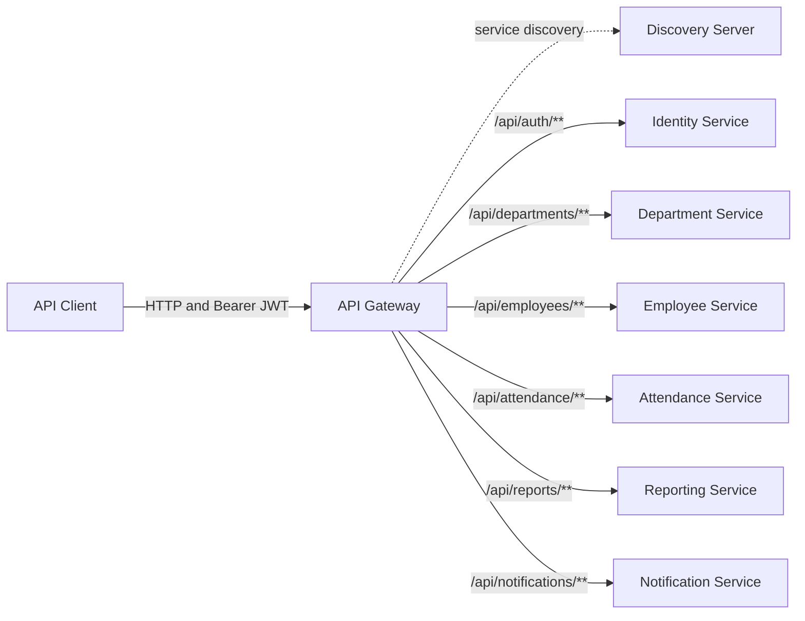
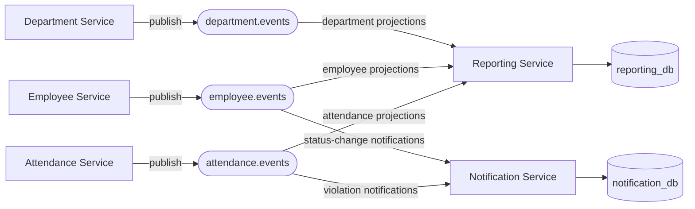
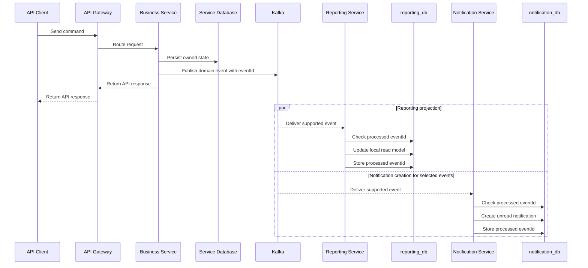

# Service Communication

The system combines synchronous HTTP requests with asynchronous Kafka events. Each service owns its data and exposes behavior through its API or event contracts; no service reads or writes another service's database.

## Synchronous Request Flow

External clients call backend APIs through the API Gateway. The gateway uses Eureka service registration and load-balanced service names to route each request.

When immediate cross-service validation is required, a service must call the owning service's HTTP API. It must never query the owning service's database directly. Reporting and Notification event consumers do not make synchronous callbacks while processing events.

## Asynchronous Event Topology

Department, Employee, and Attendance services publish domain events after successful state changes. Reporting Service consumes all three topics to build local read models. Notification Service consumes only the event types that create MVP notifications.

Event type names are case-sensitive contracts. Producers and consumers must use the exact names below.

| Topic | Event | Consumer | Result |
| --- | --- | --- | --- |
| `department.events` | `DepartmentCreated` | Reporting Service | Creates or updates a department projection. |
| `department.events` | `DepartmentManagerAssigned` | Reporting Service | Updates the projected department manager. |
| `employee.events` | `EmployeeCreated` | Reporting Service | Creates or updates an employee projection. |
| `employee.events` | `EmployeeDepartmentChanged` | Reporting Service | Updates the employee's projected department. |
| `employee.events` | `EmployeeStatusChanged` | Reporting Service | Updates the employee's projected status. |
| `employee.events` | `EmployeeStatusChanged` | Notification Service | Creates an unread HR notification. |
| `attendance.events` | `AttendanceCheckedIn` | Reporting Service | Adds the check-in contribution to the monthly projection. |
| `attendance.events` | `AttendanceCheckedOut` | Reporting Service | Adds check-out status and worked minutes to the monthly projection. |
| `attendance.events` | `AttendanceViolationDetected` | Reporting Service | Updates late or early-leave counts. |
| `attendance.events` | `AttendanceViolationDetected` | Notification Service | Creates an unread HR attendance notification. |

Reporting and Notification services ignore event types they do not handle, even when those events share a subscribed topic.

## Event Processing Flow

The producer API response does not wait for Reporting or Notification processing. Their data is eventually consistent and may briefly lag behind the source service.

## Database Ownership

| Service | Owned database | Access rule |
| --- | --- | --- |
| Identity Service | `identity_db` | Identity data only. |
| Department Service | `department_db` | Department data only. |
| Employee Service | `employee_db` | Employee data only. |
| Attendance Service | `attendance_db` | Attendance policies and records only. |
| Reporting Service | `reporting_db` | Event-built, read-only projections. |
| Notification Service | `notification_db` | Notifications and processed event IDs. |

Reporting joins information through its local projections rather than cross-database queries. Notification messages use event payload data and do not query source-service databases.

## Delivery And Consistency Rules

- Every event carries a stable `eventId`, `eventType`, timestamp, producer, version, correlation ID, and payload.
- Consumers are idempotent because Kafka may deliver an event more than once.
- Reporting records handled IDs in `processed_reporting_events` and tracks attendance contributions by attendance record ID.
- Notification records handled IDs in `processed_notification_events` to prevent duplicate notifications.
- Event payloads include the IDs and values required by consumers; consumers do not synchronously enrich an event from another service.
- A consumer failure must not roll back the producer's already completed business operation. Kafka can redeliver the event for retry.
