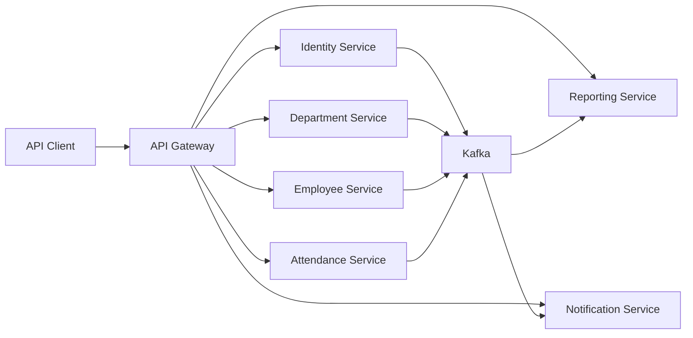

# System Context

## Notes

- External requests enter through the API Gateway.
- Identity handles authentication and user administration.
- Department and Employee publish domain events.
- Attendance publishes check-in, check-out, and violation events.
- Reporting and Notification consume Kafka events and build local read models.
