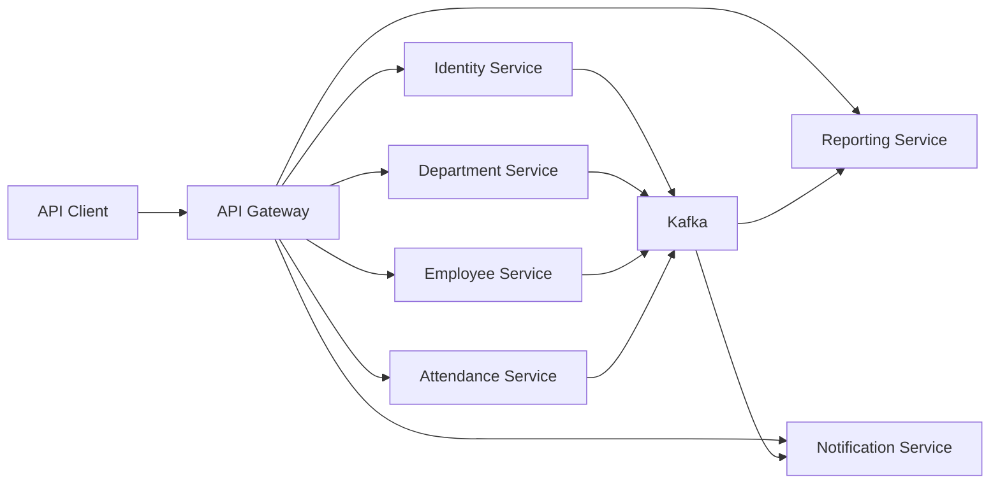

# ERP Microservices Implementation Plan

> **For agentic workers:** REQUIRED SUB-SKILL: Use superpowers:subagent-driven-development (recommended) or superpowers:executing-plans to implement this plan task-by-task. Steps use checkbox (`- [ ]`) syntax for tracking.

**Goal:** Build a spec-driven HR ERP backend with Spring Boot microservices, API Gateway, Service Discovery, PostgreSQL, Kafka, Docker, CI/CD, tests, and team workflow artifacts.

**Architecture:** Use a mono-repo containing independently deployable Spring Boot services. External traffic enters through Spring Cloud Gateway, services register with Eureka, each business service owns its PostgreSQL database, and Kafka carries domain events used by notification and reporting projections.

**Tech Stack:** Java 21, Spring Boot 3.x, Spring Cloud Gateway, Spring Cloud Netflix Eureka, Spring Security, Spring Data JPA, PostgreSQL, Flyway, Kafka, Docker Compose, OpenAPI, JUnit 5, Mockito, Testcontainers, GitHub Actions.

---

## Implementation Principles

- Build spec-first: every service starts with requirements, API contract, database design, event design, and acceptance criteria.
- Keep pull requests small: one feature or infrastructure change per PR.
- Use Git Flow: `main`, `develop`, `feature/ERP-123-short-name`, `release/x.y.z`, `hotfix/x.y.z`.
- Do not let services access another service's database.
- Prefer event-driven read models for reporting.
- Write tests before or alongside implementation.
- Keep the MVP focused on identity, organization, employee, attendance, reporting, and notifications.

## Target Repository Layout

```text
erp-system
|-- api-gateway
|-- discovery-server
|-- identity-service
|-- department-service
|-- employee-service
|-- attendance-service
|-- reporting-service
|-- notification-service
|-- common-lib
|-- docs
|   |-- adr
|   |-- api
|   |-- diagrams
|   |-- specs
|   |-- jira
|   |-- team
|   `-- interview
|-- postman
|-- docker-compose.yml
|-- README.md
`-- .github
    `-- workflows
```

## Team Assignment

For 2 members:

- Developer A: platform, gateway, discovery, identity, security, CI/CD.
- Developer B: department, employee, attendance, reporting, notification.
- Both developers review PRs, write specs, and maintain tests.

For 3 members:

- Developer A: platform, gateway, discovery, identity, security.
- Developer B: department and employee services.
- Developer C: attendance, reporting, Kafka consumers, notification.

For 4 members:

- Developer A: platform, DevOps, gateway, discovery, CI/CD.
- Developer B: identity and security.
- Developer C: department and employee services.
- Developer D: attendance, reporting, notification, Kafka.

## Jira Epic Map

```text
ERP-001 Platform Foundation
ERP-002 Identity and Access Management
ERP-003 Organization Management
ERP-004 Employee Management
ERP-005 Attendance Management
ERP-006 Reporting
ERP-007 Events and Notifications
ERP-008 DevOps and Observability
ERP-009 Documentation and Interview Evidence
```

---

## Milestone 0: Team And Repository Setup

**Goal:** Create the team operating system before coding begins.

**Owner:** All team members.

**Duration:** 2-3 days.

**Files:**

- Create: `README.md`
- Create: `docs/team/branching-strategy.md`
- Create: `docs/team/definition-of-done.md`
- Create: `docs/team/code-review-guidelines.md`
- Create: `docs/team/commit-convention.md`
- Create: `docs/jira/epics-and-stories.md`
- Create: `.github/pull_request_template.md`
- Create: `.github/ISSUE_TEMPLATE/feature_request.md`
- Create: `.github/ISSUE_TEMPLATE/bug_report.md`
- Create: `docs/adr/ADR-001-monorepo.md`

### Task 0.1: Initialize Repository Standards

- [ ] Create the GitHub repository named `erp-system`.

- [ ] Create `main` and `develop` branches.

- [ ] Protect `main` with these rules:

```text
Require pull request before merging.
Require at least 1 approval.
Require status checks to pass.
Block force pushes.
Block branch deletion.
```

- [ ] Protect `develop` with these rules:

```text
Require pull request before merging.
Require at least 1 approval.
Require status checks to pass.
```

- [ ] Add this content to `docs/team/branching-strategy.md`:

```markdown
# Branching Strategy

We use Git Flow.

Branches:

- `main`: production-ready releases only.
- `develop`: integration branch for completed features.
- `feature/ERP-123-short-name`: feature work.
- `release/1.0.0`: release stabilization.
- `hotfix/1.0.1`: urgent production fixes.

Rules:

- No direct commits to `main`.
- No direct commits to `develop`.
- Every change must be reviewed through a pull request.
- Feature branches must be created from `develop`.
- Pull requests must reference a Jira ticket.
```

- [ ] Commit:

```bash
git add docs/team/branching-strategy.md
git commit -m "docs(team): add branching strategy"
```

### Task 0.2: Define Done And Review Rules

- [ ] Add this content to `docs/team/definition-of-done.md`:

```markdown
# Definition Of Done

A ticket is done only when:

- Requirements are documented.
- API behavior is documented when an endpoint changes.
- Database migration is included when schema changes.
- Unit tests cover business rules.
- Integration tests cover database or Kafka behavior when relevant.
- OpenAPI documentation is updated.
- Docker startup still works.
- Pull request has at least one approval.
- CI pipeline passes.
- Reviewer comments are resolved.
```

- [ ] Add this content to `docs/team/code-review-guidelines.md`:

```markdown
# Code Review Guidelines

Reviewers check:

- Correctness of business behavior.
- Service boundary violations.
- Security issues.
- Missing tests.
- Database migration safety.
- Error handling.
- API contract consistency.
- Naming and readability.

Reviewers should ask questions before requesting large rewrites.
```

- [ ] Add this content to `.github/pull_request_template.md`:

```markdown
## Jira Ticket

ERP-

## Summary

Describe the change in 2-4 sentences.

## Type

- [ ] Feature
- [ ] Bug fix
- [ ] Test
- [ ] Documentation
- [ ] Infrastructure

## Testing Evidence

Commands run:

```text
./mvnw test
```

Result:

```text
BUILD SUCCESS
```

## Checklist

- [ ] Spec or ticket acceptance criteria are satisfied.
- [ ] Tests were added or updated.
- [ ] API docs were updated when needed.
- [ ] Database migration was added when needed.
- [ ] No service reads another service's database.
```

- [ ] Commit:

```bash
git add docs/team .github/pull_request_template.md
git commit -m "docs(team): add definition of done and PR template"
```

### Task 0.3: Create Jira Story Template

- [ ] Add this content to `docs/jira/epics-and-stories.md`:

```markdown
# Jira Epics And Story Template

## Epics

- ERP-001 Platform Foundation
- ERP-002 Identity and Access Management
- ERP-003 Organization Management
- ERP-004 Employee Management
- ERP-005 Attendance Management
- ERP-006 Reporting
- ERP-007 Events and Notifications
- ERP-008 DevOps and Observability
- ERP-009 Documentation and Interview Evidence

## Story Quality Standard

Every story must include a concrete user story, business rules, API contract, database changes, events, acceptance criteria, and test expectations.

Example:

Title: ERP-ATT-001 Employee check-in

User story:

As an employee,
I want to check in at the start of my workday,
so that my attendance can be recorded.

Business rules:

- A valid active employee can check in once per date.
- A duplicate check-in returns 409.
- A check-in after 09:15 is marked LATE.

API contract:

- Method: POST
- Path: /api/attendance/check-in
- Request: employeeId, checkInAt
- Response: attendanceRecordId, employeeId, attendanceDate, checkInAt, status

Database changes:

- Table: attendance_records
- Columns: id, employee_id, attendance_date, check_in_at, status, created_at, updated_at, version
- Indexes: employee_id, attendance_date, status

Events:

- Produced: AttendanceCheckedIn, AttendanceViolationDetected
- Consumed: none

Acceptance criteria:

- Given an active employee with no attendance record today, when the employee checks in, then the API returns 201.
- Given an employee already checked in today, when the employee checks in again, then the API returns 409.
- Given the employee checks in at 09:20, when the policy late threshold is 09:15, then the record status includes LATE.

Test expectations:

- Unit tests cover late arrival policy.
- Integration tests cover duplicate check-in persistence.
- Security tests verify unauthenticated requests return 401.
```

- [ ] Commit:

```bash
git add docs/jira/epics-and-stories.md
git commit -m "docs(jira): add epics and story quality standard"
```

---

## Milestone 1: Platform Foundation

**Goal:** Start all infrastructure and route traffic through the gateway.

**Owner:** Platform developer.

**Duration:** 1 week.

**Files:**

- Create: `discovery-server`
- Create: `api-gateway`
- Create: `common-lib`
- Create: `docker-compose.yml`
- Create: `.github/workflows/ci.yml`
- Create: `docs/adr/ADR-002-service-discovery.md`
- Create: `docs/adr/ADR-003-docker-compose-local-dev.md`

### Task 1.1: Generate Spring Boot Services

- [ ] Create `discovery-server` from Spring Initializr with:

```text
Project: Maven
Language: Java
Spring Boot: 3.x
Java: 21
Dependencies: Eureka Server, Spring Boot Actuator
Group: com.example.erp
Artifact: discovery-server
```

- [ ] Create `api-gateway` from Spring Initializr with:

```text
Project: Maven
Language: Java
Spring Boot: 3.x
Java: 21
Dependencies: Spring Cloud Gateway, Eureka Discovery Client, Spring Boot Actuator, Spring Security
Group: com.example.erp
Artifact: api-gateway
```

- [ ] Create `common-lib` as a Maven module for shared DTOs and error response types:

```text
Group: com.example.erp
Artifact: common-lib
Packaging: jar
Java: 21
```

- [ ] Commit:

```bash
git add discovery-server api-gateway common-lib
git commit -m "feat(platform): scaffold discovery gateway and common library"
```

### Task 1.2: Configure Discovery Server

- [ ] In `discovery-server/src/main/resources/application.yml`, configure:

```yaml
server:
  port: 8761

spring:
  application:
    name: discovery-server

eureka:
  client:
    register-with-eureka: false
    fetch-registry: false

management:
  endpoints:
    web:
      exposure:
        include: health,info
```

- [ ] In `discovery-server/src/main/java/com/example/erp/discoveryserver/DiscoveryServerApplication.java`, enable Eureka:

```java
package com.example.erp.discoveryserver;

import org.springframework.boot.SpringApplication;
import org.springframework.boot.autoconfigure.SpringBootApplication;
import org.springframework.cloud.netflix.eureka.server.EnableEurekaServer;

@EnableEurekaServer
@SpringBootApplication
public class DiscoveryServerApplication {
    public static void main(String[] args) {
        SpringApplication.run(DiscoveryServerApplication.class, args);
    }
}
```

- [ ] Run:

```bash
cd discovery-server
./mvnw test
```

Expected:

```text
BUILD SUCCESS
```

- [ ] Commit:

```bash
git add discovery-server
git commit -m "feat(platform): configure discovery server"
```

### Task 1.3: Configure Gateway Routes

- [ ] In `api-gateway/src/main/resources/application.yml`, configure:

```yaml
server:
  port: 8080

spring:
  application:
    name: api-gateway
  cloud:
    gateway:
      routes:
        - id: identity-service
          uri: lb://identity-service
          predicates:
            - Path=/api/auth/**,/api/users/**
        - id: department-service
          uri: lb://department-service
          predicates:
            - Path=/api/departments/**
        - id: employee-service
          uri: lb://employee-service
          predicates:
            - Path=/api/employees/**
        - id: attendance-service
          uri: lb://attendance-service
          predicates:
            - Path=/api/attendance/**
        - id: reporting-service
          uri: lb://reporting-service
          predicates:
            - Path=/api/reports/**
        - id: notification-service
          uri: lb://notification-service
          predicates:
            - Path=/api/notifications/**

eureka:
  client:
    service-url:
      defaultZone: http://localhost:8761/eureka

management:
  endpoints:
    web:
      exposure:
        include: health,info
```

- [ ] Run:

```bash
cd api-gateway
./mvnw test
```

Expected:

```text
BUILD SUCCESS
```

- [ ] Commit:

```bash
git add api-gateway
git commit -m "feat(platform): configure gateway routes"
```

### Task 1.4: Add Common API Response Types

- [ ] In `common-lib/src/main/java/com/example/erp/common/api/ApiResponse.java`, create:

```java
package com.example.erp.common.api;

import java.time.Instant;

public record ApiResponse<T>(
        T data,
        String message,
        Instant timestamp
) {
    public static <T> ApiResponse<T> success(T data) {
        return new ApiResponse<>(data, "Success", Instant.now());
    }
}
```

- [ ] In `common-lib/src/main/java/com/example/erp/common/api/ErrorResponse.java`, create:

```java
package com.example.erp.common.api;

import java.time.Instant;

public record ErrorResponse(
        String errorCode,
        String message,
        String path,
        Instant timestamp
) {
    public static ErrorResponse of(String errorCode, String message, String path) {
        return new ErrorResponse(errorCode, message, path, Instant.now());
    }
}
```

- [ ] Run:

```bash
cd common-lib
./mvnw test
```

Expected:

```text
BUILD SUCCESS
```

- [ ] Commit:

```bash
git add common-lib
git commit -m "feat(common): add standard API response types"
```

### Task 1.5: Add Docker Compose Infrastructure

- [ ] Create `docker-compose.yml`:

```yaml
services:
  postgres-identity:
    image: postgres:16
    environment:
      POSTGRES_DB: identity_db
      POSTGRES_USER: identity_user
      POSTGRES_PASSWORD: identity_pass
    ports:
      - "5433:5432"

  postgres-department:
    image: postgres:16
    environment:
      POSTGRES_DB: department_db
      POSTGRES_USER: department_user
      POSTGRES_PASSWORD: department_pass
    ports:
      - "5434:5432"

  postgres-employee:
    image: postgres:16
    environment:
      POSTGRES_DB: employee_db
      POSTGRES_USER: employee_user
      POSTGRES_PASSWORD: employee_pass
    ports:
      - "5435:5432"

  postgres-attendance:
    image: postgres:16
    environment:
      POSTGRES_DB: attendance_db
      POSTGRES_USER: attendance_user
      POSTGRES_PASSWORD: attendance_pass
    ports:
      - "5436:5432"

  postgres-reporting:
    image: postgres:16
    environment:
      POSTGRES_DB: reporting_db
      POSTGRES_USER: reporting_user
      POSTGRES_PASSWORD: reporting_pass
    ports:
      - "5437:5432"

  postgres-notification:
    image: postgres:16
    environment:
      POSTGRES_DB: notification_db
      POSTGRES_USER: notification_user
      POSTGRES_PASSWORD: notification_pass
    ports:
      - "5438:5432"

  kafka:
    image: bitnami/kafka:3.7
    ports:
      - "9092:9092"
    environment:
      KAFKA_CFG_NODE_ID: 1
      KAFKA_CFG_PROCESS_ROLES: broker,controller
      KAFKA_CFG_CONTROLLER_QUORUM_VOTERS: 1@kafka:9093
      KAFKA_CFG_LISTENERS: PLAINTEXT://:9092,CONTROLLER://:9093
      KAFKA_CFG_ADVERTISED_LISTENERS: PLAINTEXT://localhost:9092
      KAFKA_CFG_CONTROLLER_LISTENER_NAMES: CONTROLLER
      KAFKA_CFG_AUTO_CREATE_TOPICS_ENABLE: true
```

- [ ] Run:

```bash
docker compose up -d
docker compose ps
```

Expected:

```text
All postgres containers are running.
Kafka container is running.
```

- [ ] Commit:

```bash
git add docker-compose.yml
git commit -m "feat(platform): add local docker compose infrastructure"
```

### Task 1.6: Add CI Pipeline

- [ ] Create `.github/workflows/ci.yml`:

```yaml
name: CI

on:
  pull_request:
    branches:
      - develop
      - main
  push:
    branches:
      - develop
      - main

jobs:
  build:
    runs-on: ubuntu-latest
    strategy:
      matrix:
        service:
          - discovery-server
          - api-gateway
          - common-lib
    steps:
      - name: Checkout
        uses: actions/checkout@v4

      - name: Set up Java
        uses: actions/setup-java@v4
        with:
          distribution: temurin
          java-version: "21"

      - name: Build service
        working-directory: ${{ matrix.service }}
        run: ./mvnw test
```

- [ ] Commit:

```bash
git add .github/workflows/ci.yml
git commit -m "ci: add initial service build workflow"
```

---

## Milestone 2: Identity And Access Management

**Goal:** Implement login, user management, JWT, and role-based access.

**Owner:** Security developer.

**Duration:** 1-2 weeks.

**Files:**

- Create: `identity-service`
- Create: `docs/specs/identity/requirements.md`
- Create: `docs/specs/identity/api-contract.yaml`
- Create: `docs/specs/identity/database-schema.md`
- Create: `docs/specs/identity/events.md`
- Create: `docs/specs/identity/acceptance-tests.md`

### Task 2.1: Write Identity Service Spec

- [ ] Create `docs/specs/identity/requirements.md`:

```markdown
# Identity Service Requirements

Identity Service owns users, credentials, roles, and authentication.

Roles:

- ADMIN
- HR_MANAGER
- DEPARTMENT_MANAGER
- EMPLOYEE

Business rules:

- Passwords are stored only as BCrypt hashes.
- Disabled users cannot log in.
- Login returns a JWT access token.
- A user can have one or more roles.
- Only ADMIN can create users and change roles.
```

- [ ] Create `docs/specs/identity/acceptance-tests.md`:

```markdown
# Identity Acceptance Tests

## Login succeeds

Given an active user with a valid password
When the user logs in
Then the API returns 200
And the response contains a JWT access token.

## Login rejects disabled user

Given a disabled user
When the user logs in with a valid password
Then the API returns 403.

## Admin creates user

Given an ADMIN token
When the admin creates a user
Then the API returns 201
And a UserCreated event is published.
```

- [ ] Commit:

```bash
git add docs/specs/identity
git commit -m "docs(identity): add service spec"
```

### Task 2.2: Scaffold Identity Service

- [ ] Generate `identity-service` with:

```text
Dependencies: Spring Web, Spring Security, Spring Data JPA, PostgreSQL Driver, Flyway, Eureka Discovery Client, Validation, Spring Boot Actuator, Spring for Apache Kafka, Springdoc OpenAPI
```

- [ ] Configure `identity-service/src/main/resources/application.yml`:

```yaml
server:
  port: 8081

spring:
  application:
    name: identity-service
  datasource:
    url: jdbc:postgresql://localhost:5433/identity_db
    username: identity_user
    password: identity_pass
  jpa:
    hibernate:
      ddl-auto: validate
  flyway:
    enabled: true
  kafka:
    bootstrap-servers: localhost:9092

eureka:
  client:
    service-url:
      defaultZone: http://localhost:8761/eureka

jwt:
  secret: change-this-dev-secret-change-in-production
  expiration-minutes: 60
```

- [ ] Commit:

```bash
git add identity-service
git commit -m "feat(identity): scaffold service"
```

### Task 2.3: Implement Identity Data Model

- [ ] Create Flyway migration `identity-service/src/main/resources/db/migration/V1__create_identity_tables.sql`:

```sql
CREATE TABLE users (
    id UUID PRIMARY KEY,
    email VARCHAR(255) NOT NULL UNIQUE,
    password_hash VARCHAR(255) NOT NULL,
    full_name VARCHAR(255) NOT NULL,
    status VARCHAR(30) NOT NULL,
    created_at TIMESTAMP WITH TIME ZONE NOT NULL,
    updated_at TIMESTAMP WITH TIME ZONE NOT NULL,
    version BIGINT NOT NULL
);

CREATE TABLE roles (
    id UUID PRIMARY KEY,
    name VARCHAR(80) NOT NULL UNIQUE
);

CREATE TABLE user_roles (
    user_id UUID NOT NULL,
    role_id UUID NOT NULL,
    PRIMARY KEY (user_id, role_id),
    CONSTRAINT fk_user_roles_user FOREIGN KEY (user_id) REFERENCES users(id),
    CONSTRAINT fk_user_roles_role FOREIGN KEY (role_id) REFERENCES roles(id)
);

CREATE INDEX idx_users_email ON users(email);
CREATE INDEX idx_users_status ON users(status);
```

- [ ] Implement entities:

```text
identity-service/src/main/java/com/example/erp/identity/user/User.java
identity-service/src/main/java/com/example/erp/identity/user/UserStatus.java
identity-service/src/main/java/com/example/erp/identity/role/Role.java
identity-service/src/main/java/com/example/erp/identity/user/UserRepository.java
identity-service/src/main/java/com/example/erp/identity/role/RoleRepository.java
```

- [ ] Run:

```bash
cd identity-service
./mvnw test
```

Expected:

```text
BUILD SUCCESS
```

- [ ] Commit:

```bash
git add identity-service
git commit -m "feat(identity): add user and role persistence model"
```

### Task 2.4: Implement Login And JWT

- [ ] Implement request and response records:

```text
LoginRequest(email, password)
LoginResponse(accessToken, tokenType, expiresInMinutes)
```

- [ ] Implement:

```text
AuthController
AuthService
JwtService
SecurityConfig
```

- [ ] Add tests:

```text
AuthServiceTest verifies active user login succeeds.
AuthServiceTest verifies disabled user login fails.
JwtServiceTest verifies generated token contains subject and roles.
```

- [ ] Run:

```bash
cd identity-service
./mvnw test
```

Expected:

```text
BUILD SUCCESS
```

- [ ] Commit:

```bash
git add identity-service
git commit -m "feat(identity): add login and JWT issuing"
```

### Task 2.5: Add User Management APIs

- [ ] Implement APIs:

```text
POST /api/users
GET /api/users/{id}
PATCH /api/users/{id}/status
PUT /api/users/{id}/roles
```

- [ ] Add events:

```text
UserCreated
UserDisabled
UserRolesChanged
```

- [ ] Add controller tests for:

```text
ADMIN can create user.
EMPLOYEE cannot create user.
Duplicate email returns 409.
Missing required fields return 400.
```

- [ ] Commit:

```bash
git add identity-service docs/specs/identity
git commit -m "feat(identity): add user management APIs"
```

---

## Milestone 3: Department Service

**Goal:** Manage company departments and department managers.

**Owner:** Organization developer.

**Duration:** 1 week.

**Files:**

- Create: `department-service`
- Create: `docs/specs/department/requirements.md`
- Create: `docs/specs/department/api-contract.yaml`
- Create: `docs/specs/department/database-schema.md`
- Create: `docs/specs/department/events.md`
- Create: `docs/specs/department/acceptance-tests.md`

### Task 3.1: Write Department Service Spec

- [ ] Document requirements:

```markdown
# Department Service Requirements

Department Service owns organizational departments.

Business rules:

- Department name must be unique.
- A department can have one parent department.
- A department can have one manager user id.
- Deleting departments is not part of MVP.
- Only ADMIN and HR_MANAGER can create or update departments.
```

- [ ] Document events:

```markdown
# Department Events

## DepartmentCreated

Payload:

- departmentId
- name
- parentDepartmentId
- managerUserId

## DepartmentManagerAssigned

Payload:

- departmentId
- managerUserId
```

- [ ] Commit:

```bash
git add docs/specs/department
git commit -m "docs(department): add service spec"
```

### Task 3.2: Scaffold And Configure Department Service

- [ ] Generate `department-service` with:

```text
Dependencies: Spring Web, Spring Data JPA, PostgreSQL Driver, Flyway, Eureka Discovery Client, Validation, Spring Boot Actuator, Spring for Apache Kafka, Springdoc OpenAPI
```

- [ ] Configure service name `department-service`, port `8082`, database port `5434`, and Kafka `localhost:9092`.

- [ ] Add Flyway migration:

```sql
CREATE TABLE departments (
    id UUID PRIMARY KEY,
    name VARCHAR(150) NOT NULL UNIQUE,
    description VARCHAR(500),
    parent_department_id UUID,
    manager_user_id UUID,
    created_at TIMESTAMP WITH TIME ZONE NOT NULL,
    updated_at TIMESTAMP WITH TIME ZONE NOT NULL,
    version BIGINT NOT NULL
);

CREATE INDEX idx_departments_parent ON departments(parent_department_id);
CREATE INDEX idx_departments_manager ON departments(manager_user_id);
```

- [ ] Commit:

```bash
git add department-service
git commit -m "feat(department): scaffold service and schema"
```

### Task 3.3: Implement Department APIs

- [ ] Implement:

```text
POST /api/departments
GET /api/departments
GET /api/departments/{id}
PUT /api/departments/{id}
PATCH /api/departments/{id}/manager
```

- [ ] Add tests:

```text
Create department returns 201.
Duplicate department name returns 409.
Assign manager updates managerUserId.
Missing department returns 404.
```

- [ ] Publish:

```text
DepartmentCreated
DepartmentManagerAssigned
```

- [ ] Commit:

```bash
git add department-service docs/specs/department
git commit -m "feat(department): add department management APIs"
```

---

## Milestone 4: Employee Service

**Goal:** Manage employee profiles, department assignment, and employment status.

**Owner:** HR developer.

**Duration:** 1 week.

**Files:**

- Create: `employee-service`
- Create: `docs/specs/employee/requirements.md`
- Create: `docs/specs/employee/api-contract.yaml`
- Create: `docs/specs/employee/database-schema.md`
- Create: `docs/specs/employee/events.md`
- Create: `docs/specs/employee/acceptance-tests.md`

### Task 4.1: Write Employee Service Spec

- [ ] Document requirements:

```markdown
# Employee Service Requirements

Employee Service owns employee profiles and employment state.

Business rules:

- Employee number must be unique.
- Employee email must be unique.
- Employee status must be one of ACTIVE, ON_LEAVE, SUSPENDED, TERMINATED.
- Employee can reference a department by departmentId.
- Employee can reference a manager by managerEmployeeId.
- Only ADMIN and HR_MANAGER can create or update employees.
```

- [ ] Commit:

```bash
git add docs/specs/employee
git commit -m "docs(employee): add service spec"
```

### Task 4.2: Scaffold And Configure Employee Service

- [ ] Generate `employee-service` with:

```text
Dependencies: Spring Web, Spring Data JPA, PostgreSQL Driver, Flyway, Eureka Discovery Client, Validation, Spring Boot Actuator, Spring for Apache Kafka, Springdoc OpenAPI
```

- [ ] Configure service name `employee-service`, port `8083`, database port `5435`, and Kafka `localhost:9092`.

- [ ] Add Flyway migration:

```sql
CREATE TABLE employees (
    id UUID PRIMARY KEY,
    user_id UUID,
    employee_number VARCHAR(80) NOT NULL UNIQUE,
    first_name VARCHAR(120) NOT NULL,
    last_name VARCHAR(120) NOT NULL,
    email VARCHAR(255) NOT NULL UNIQUE,
    job_title VARCHAR(150) NOT NULL,
    department_id UUID,
    manager_employee_id UUID,
    status VARCHAR(30) NOT NULL,
    hire_date DATE NOT NULL,
    created_at TIMESTAMP WITH TIME ZONE NOT NULL,
    updated_at TIMESTAMP WITH TIME ZONE NOT NULL,
    version BIGINT NOT NULL
);

CREATE INDEX idx_employees_department ON employees(department_id);
CREATE INDEX idx_employees_manager ON employees(manager_employee_id);
CREATE INDEX idx_employees_status ON employees(status);
```

- [ ] Commit:

```bash
git add employee-service
git commit -m "feat(employee): scaffold service and schema"
```

### Task 4.3: Implement Employee APIs

- [ ] Implement:

```text
POST /api/employees
GET /api/employees
GET /api/employees/{id}
PUT /api/employees/{id}
PATCH /api/employees/{id}/department
PATCH /api/employees/{id}/status
```

- [ ] Add tests:

```text
Create employee returns 201.
Duplicate employee number returns 409.
Changing department publishes EmployeeDepartmentChanged.
Changing status publishes EmployeeStatusChanged.
Missing employee returns 404.
```

- [ ] Publish:

```text
EmployeeCreated
EmployeeDepartmentChanged
EmployeeStatusChanged
```

- [ ] Commit:

```bash
git add employee-service docs/specs/employee
git commit -m "feat(employee): add employee management APIs"
```

---

## Milestone 5: Attendance Service

**Goal:** Implement check-in, check-out, attendance rules, and monthly summaries.

**Owner:** Attendance developer.

**Duration:** 2 weeks.

**Files:**

- Create: `attendance-service`
- Create: `docs/specs/attendance/requirements.md`
- Create: `docs/specs/attendance/api-contract.yaml`
- Create: `docs/specs/attendance/database-schema.md`
- Create: `docs/specs/attendance/events.md`
- Create: `docs/specs/attendance/acceptance-tests.md`

### Task 5.1: Write Attendance Service Spec

- [ ] Create requirements:

```markdown
# Attendance Service Requirements

Attendance Service owns check-in, check-out, and attendance rules.

Business rules:

- One employee can have only one attendance record per date.
- Workday starts at 09:00.
- Check-in after 09:15 is LATE.
- Check-out before 16:00 is EARLY_LEAVE.
- Check-out requires an existing check-in for the same date.
- Monthly summary includes present days, late days, early leave days, absent days, and total worked minutes.
```

- [ ] Create acceptance tests:

```markdown
# Attendance Acceptance Tests

## Check-in succeeds

Given an active employee
When the employee checks in for the first time today
Then the API returns 201
And AttendanceCheckedIn is published.

## Duplicate check-in fails

Given an employee has already checked in today
When the employee checks in again
Then the API returns 409.

## Late check-in creates violation

Given workday starts at 09:00
When the employee checks in at 09:20
Then the record includes LATE
And AttendanceViolationDetected is published.
```

- [ ] Commit:

```bash
git add docs/specs/attendance
git commit -m "docs(attendance): add service spec"
```

### Task 5.2: Scaffold And Configure Attendance Service

- [ ] Generate `attendance-service` with:

```text
Dependencies: Spring Web, Spring Data JPA, PostgreSQL Driver, Flyway, Eureka Discovery Client, Validation, Spring Boot Actuator, Spring for Apache Kafka, Springdoc OpenAPI
```

- [ ] Configure service name `attendance-service`, port `8084`, database port `5436`, and Kafka `localhost:9092`.

- [ ] Add Flyway migration:

```sql
CREATE TABLE attendance_policies (
    id UUID PRIMARY KEY,
    name VARCHAR(120) NOT NULL,
    workday_start TIME NOT NULL,
    late_after TIME NOT NULL,
    early_leave_before TIME NOT NULL,
    active BOOLEAN NOT NULL,
    created_at TIMESTAMP WITH TIME ZONE NOT NULL,
    updated_at TIMESTAMP WITH TIME ZONE NOT NULL,
    version BIGINT NOT NULL
);

CREATE TABLE attendance_records (
    id UUID PRIMARY KEY,
    employee_id UUID NOT NULL,
    attendance_date DATE NOT NULL,
    check_in_at TIMESTAMP WITH TIME ZONE,
    check_out_at TIMESTAMP WITH TIME ZONE,
    status VARCHAR(40) NOT NULL,
    worked_minutes INTEGER NOT NULL DEFAULT 0,
    created_at TIMESTAMP WITH TIME ZONE NOT NULL,
    updated_at TIMESTAMP WITH TIME ZONE NOT NULL,
    version BIGINT NOT NULL,
    CONSTRAINT uq_attendance_employee_date UNIQUE (employee_id, attendance_date)
);

CREATE INDEX idx_attendance_employee ON attendance_records(employee_id);
CREATE INDEX idx_attendance_date ON attendance_records(attendance_date);
CREATE INDEX idx_attendance_status ON attendance_records(status);
```

- [ ] Commit:

```bash
git add attendance-service
git commit -m "feat(attendance): scaffold service and schema"
```

### Task 5.3: Implement Attendance Rules With Tests

- [ ] Create unit tests for the attendance policy:

```text
09:00 check-in returns PRESENT.
09:15 check-in returns PRESENT.
09:16 check-in returns LATE.
15:59 check-out returns EARLY_LEAVE.
16:00 check-out does not return EARLY_LEAVE.
```

- [ ] Implement:

```text
AttendancePolicyEvaluator
AttendanceStatus
AttendanceRecord
AttendanceRecordRepository
```

- [ ] Run:

```bash
cd attendance-service
./mvnw test
```

Expected:

```text
BUILD SUCCESS
```

- [ ] Commit:

```bash
git add attendance-service
git commit -m "feat(attendance): add attendance policy evaluation"
```

### Task 5.4: Implement Check-In And Check-Out APIs

- [ ] Implement:

```text
POST /api/attendance/check-in
POST /api/attendance/check-out
GET /api/attendance/employees/{employeeId}
GET /api/attendance/employees/{employeeId}/monthly-summary
```

- [ ] Add tests:

```text
First check-in returns 201.
Duplicate check-in returns 409.
Check-out without check-in returns 409.
Late check-in publishes AttendanceViolationDetected.
Check-out calculates worked minutes.
Monthly summary returns aggregated attendance counts.
```

- [ ] Publish:

```text
AttendanceCheckedIn
AttendanceCheckedOut
AttendanceViolationDetected
```

- [ ] Commit:

```bash
git add attendance-service docs/specs/attendance
git commit -m "feat(attendance): add check-in check-out and summaries"
```

---

## Milestone 6: Reporting Service

**Goal:** Build event-fed read models and expose reporting APIs.

**Owner:** Reporting developer.

**Duration:** 1 week.

**Files:**

- Create: `reporting-service`
- Create: `docs/specs/reporting/requirements.md`
- Create: `docs/specs/reporting/api-contract.yaml`
- Create: `docs/specs/reporting/database-schema.md`
- Create: `docs/specs/reporting/events.md`
- Create: `docs/specs/reporting/acceptance-tests.md`

### Task 6.1: Write Reporting Service Spec

- [ ] Document:

```markdown
# Reporting Service Requirements

Reporting Service owns read-only report projections.

Business rules:

- Reporting Service must not query operational service databases.
- Reporting Service consumes Kafka events and updates local read models.
- Reports may be eventually consistent.
- Reports expose department headcount, employee status summary, and monthly attendance summary.
```

- [ ] Commit:

```bash
git add docs/specs/reporting
git commit -m "docs(reporting): add service spec"
```

### Task 6.2: Scaffold Reporting Service And Projections

- [ ] Generate `reporting-service` with:

```text
Dependencies: Spring Web, Spring Data JPA, PostgreSQL Driver, Flyway, Eureka Discovery Client, Validation, Spring Boot Actuator, Spring for Apache Kafka, Springdoc OpenAPI
```

- [ ] Configure service name `reporting-service`, port `8085`, database port `5437`, and Kafka `localhost:9092`.

- [ ] Add Flyway migration:

```sql
CREATE TABLE employee_report_views (
    employee_id UUID PRIMARY KEY,
    department_id UUID,
    status VARCHAR(30) NOT NULL,
    job_title VARCHAR(150),
    updated_at TIMESTAMP WITH TIME ZONE NOT NULL
);

CREATE TABLE department_report_views (
    department_id UUID PRIMARY KEY,
    name VARCHAR(150) NOT NULL,
    manager_user_id UUID,
    updated_at TIMESTAMP WITH TIME ZONE NOT NULL
);

CREATE TABLE attendance_monthly_report_views (
    id UUID PRIMARY KEY,
    employee_id UUID NOT NULL,
    report_year INTEGER NOT NULL,
    report_month INTEGER NOT NULL,
    present_days INTEGER NOT NULL,
    late_days INTEGER NOT NULL,
    early_leave_days INTEGER NOT NULL,
    absent_days INTEGER NOT NULL,
    total_worked_minutes INTEGER NOT NULL,
    updated_at TIMESTAMP WITH TIME ZONE NOT NULL,
    CONSTRAINT uq_attendance_monthly_employee_month UNIQUE (employee_id, report_year, report_month)
);
```

- [ ] Commit:

```bash
git add reporting-service
git commit -m "feat(reporting): scaffold service and projections"
```

### Task 6.3: Consume Events And Expose Reports

- [ ] Consume:

```text
DepartmentCreated
DepartmentManagerAssigned
EmployeeCreated
EmployeeDepartmentChanged
EmployeeStatusChanged
AttendanceCheckedIn
AttendanceCheckedOut
AttendanceViolationDetected
```

- [ ] Implement:

```text
GET /api/reports/attendance/monthly
GET /api/reports/departments/{departmentId}/attendance
GET /api/reports/employees/status-summary
GET /api/reports/departments/headcount
```

- [ ] Add tests:

```text
EmployeeCreated creates employee projection.
EmployeeDepartmentChanged updates department in employee projection.
DepartmentCreated creates department projection.
AttendanceCheckedOut updates monthly attendance projection.
Headcount report counts active employees by department.
```

- [ ] Commit:

```bash
git add reporting-service docs/specs/reporting
git commit -m "feat(reporting): add event projections and report APIs"
```

---

## Milestone 7: Notification Service

**Goal:** Store notifications created from important domain events.

**Owner:** Notification developer.

**Duration:** 1 week.

**Files:**

- Create: `notification-service`
- Create: `docs/specs/notification/requirements.md`
- Create: `docs/specs/notification/api-contract.yaml`
- Create: `docs/specs/notification/database-schema.md`
- Create: `docs/specs/notification/events.md`
- Create: `docs/specs/notification/acceptance-tests.md`

### Task 7.1: Write Notification Service Spec

- [ ] Document:

```markdown
# Notification Service Requirements

Notification Service stores notifications triggered by domain events.

Business rules:

- Attendance violations create HR notifications.
- Employee status changes create HR notifications.
- Notifications can be read or unread.
- Real email and SMS delivery are outside MVP.
```

- [ ] Commit:

```bash
git add docs/specs/notification
git commit -m "docs(notification): add service spec"
```

### Task 7.2: Scaffold Notification Service

- [ ] Generate `notification-service` with:

```text
Dependencies: Spring Web, Spring Data JPA, PostgreSQL Driver, Flyway, Eureka Discovery Client, Validation, Spring Boot Actuator, Spring for Apache Kafka, Springdoc OpenAPI
```

- [ ] Configure service name `notification-service`, port `8086`, database port `5438`, and Kafka `localhost:9092`.

- [ ] Add Flyway migration:

```sql
CREATE TABLE notifications (
    id UUID PRIMARY KEY,
    recipient_role VARCHAR(80) NOT NULL,
    recipient_user_id UUID,
    type VARCHAR(80) NOT NULL,
    title VARCHAR(180) NOT NULL,
    body VARCHAR(1000) NOT NULL,
    read BOOLEAN NOT NULL,
    created_at TIMESTAMP WITH TIME ZONE NOT NULL,
    read_at TIMESTAMP WITH TIME ZONE,
    version BIGINT NOT NULL
);

CREATE INDEX idx_notifications_recipient_role ON notifications(recipient_role);
CREATE INDEX idx_notifications_recipient_user ON notifications(recipient_user_id);
CREATE INDEX idx_notifications_read ON notifications(read);
```

- [ ] Commit:

```bash
git add notification-service
git commit -m "feat(notification): scaffold service and schema"
```

### Task 7.3: Consume Events And Expose Notification APIs

- [ ] Consume:

```text
AttendanceViolationDetected
EmployeeStatusChanged
```

- [ ] Implement:

```text
GET /api/notifications
PATCH /api/notifications/{id}/read
```

- [ ] Add tests:

```text
AttendanceViolationDetected creates unread HR notification.
EmployeeStatusChanged creates unread HR notification.
Mark notification read sets read true and readAt.
Missing notification returns 404.
```

- [ ] Commit:

```bash
git add notification-service docs/specs/notification
git commit -m "feat(notification): add event-driven notifications"
```

---

## Milestone 8: System Integration And DevOps Polish

**Goal:** Make the whole system easy to run, test, review, and present.

**Owner:** All team members.

**Duration:** 1-2 weeks.

**Files:**

- Modify: `docker-compose.yml`
- Modify: `.github/workflows/ci.yml`
- Create: `docs/diagrams/system-context.md`
- Create: `docs/diagrams/service-communication.md`
- Create: `postman/erp-system.postman_collection.json`
- Create: `docs/interview/project-walkthrough.md`
- Create: `docs/interview/resume-bullets.md`

### Task 8.1: Add All Services To Docker Compose

- [ ] Add each Spring Boot service to `docker-compose.yml`:

```text
discovery-server
api-gateway
identity-service
department-service
employee-service
attendance-service
reporting-service
notification-service
```

- [ ] Configure service dependencies:

```text
Gateway depends on discovery-server.
Business services depend on discovery-server, Kafka, and their own PostgreSQL container.
Reporting and notification depend on Kafka and their own PostgreSQL container.
```

- [ ] Run:

```bash
docker compose up --build
```

Expected:

```text
Discovery Server starts on 8761.
Gateway starts on 8080.
Business services register with Eureka.
PostgreSQL containers are healthy.
Kafka is reachable by event producers and consumers.
```

- [ ] Commit:

```bash
git add docker-compose.yml
git commit -m "devops: run full system with docker compose"
```

### Task 8.2: Expand CI To All Services

- [ ] Update `.github/workflows/ci.yml` matrix:

```yaml
strategy:
  matrix:
    service:
      - discovery-server
      - api-gateway
      - common-lib
      - identity-service
      - department-service
      - employee-service
      - attendance-service
      - reporting-service
      - notification-service
```

- [ ] Commit:

```bash
git add .github/workflows/ci.yml
git commit -m "ci: build and test all services"
```

### Task 8.3: Add Architecture Diagrams

- [ ] Create `docs/diagrams/system-context.md`:

````markdown
# System Context


````

- [ ] Create `docs/diagrams/service-communication.md`:

```markdown
# Service Communication

Synchronous communication:

- External clients call API Gateway.
- API Gateway routes to backend services.
- Services may call another service over HTTP for immediate validation.

Asynchronous communication:

- Business services publish domain events to Kafka.
- Reporting Service consumes events to update read models.
- Notification Service consumes events to create notifications.

Database ownership:

- Each service owns its database.
- No service directly queries another service's database.
```

- [ ] Commit:

```bash
git add docs/diagrams
git commit -m "docs(architecture): add system diagrams"
```

### Task 8.4: Add Interview Evidence

- [ ] Create `docs/interview/project-walkthrough.md`:

```markdown
# Project Walkthrough

## Problem

The project simulates a small enterprise HR ERP backend for users, departments, employees, attendance, reporting, and notifications.

## Architecture

The system uses Spring Boot microservices, Spring Cloud Gateway, Eureka, PostgreSQL per service, Kafka events, Docker Compose, and GitHub Actions.

## Strong Interview Topics

- Service boundaries and database ownership.
- JWT authentication and role-based authorization.
- Kafka event design.
- Reporting through projections.
- Attendance business rules.
- Testcontainers integration testing.
- PR-based team workflow.
- CI/CD pipeline design.

## Demo Flow

1. Start the system with Docker Compose.
2. Log in as admin.
3. Create a department.
4. Create an employee.
5. Assign employee to department.
6. Check in late.
7. Show attendance violation notification.
8. Show monthly attendance report.
```

- [ ] Create `docs/interview/resume-bullets.md`:

```markdown
# Resume Bullets

- Designed and implemented a spec-driven HR ERP backend using Spring Boot microservices, Spring Cloud Gateway, Eureka, Kafka, PostgreSQL, Docker, GitHub Actions, JWT RBAC, OpenAPI, Flyway, and Testcontainers.
- Built event-driven reporting projections with Kafka to avoid cross-service database joins and preserve service ownership boundaries.
- Simulated enterprise team workflow using Git Flow, Jira-style stories, pull requests, code review, CI checks, and architecture decision records.
```

- [ ] Commit:

```bash
git add docs/interview
git commit -m "docs(interview): add project walkthrough and resume bullets"
```

---

## Recommended Sprint Plan

### Sprint 0: Setup

Duration: 2-3 days.

Tickets:

- ERP-001: Initialize repository and branch protections.
- ERP-002: Add team workflow docs.
- ERP-003: Add PR and issue templates.
- ERP-004: Add Jira epics and story template.

### Sprint 1: Platform

Duration: 1 week.

Tickets:

- ERP-101: Scaffold Discovery Server.
- ERP-102: Scaffold API Gateway.
- ERP-103: Add common response and error DTOs.
- ERP-104: Add Docker Compose infrastructure.
- ERP-105: Add initial CI pipeline.

### Sprint 2: Identity

Duration: 1-2 weeks.

Tickets:

- ERP-201: Add Identity Service spec.
- ERP-202: Add user and role schema.
- ERP-203: Implement login and JWT.
- ERP-204: Implement user management APIs.
- ERP-205: Add protected endpoint tests.

### Sprint 3: Organization And Employees

Duration: 2 weeks.

Tickets:

- ERP-301: Add Department Service spec.
- ERP-302: Implement Department Service.
- ERP-303: Publish department events.
- ERP-401: Add Employee Service spec.
- ERP-402: Implement Employee Service.
- ERP-403: Publish employee events.

### Sprint 4: Attendance

Duration: 2 weeks.

Tickets:

- ERP-501: Add Attendance Service spec.
- ERP-502: Add attendance schema.
- ERP-503: Implement attendance policy evaluator.
- ERP-504: Implement check-in.
- ERP-505: Implement check-out.
- ERP-506: Implement monthly summary.
- ERP-507: Publish attendance events.

### Sprint 5: Reporting And Notifications

Duration: 2 weeks.

Tickets:

- ERP-601: Add Reporting Service spec.
- ERP-602: Build reporting projections.
- ERP-603: Implement report APIs.
- ERP-701: Add Notification Service spec.
- ERP-702: Consume violation events.
- ERP-703: Implement notification APIs.

### Sprint 6: Polish And Presentation

Duration: 1-2 weeks.

Tickets:

- ERP-801: Add all services to Docker Compose.
- ERP-802: Expand CI to all services.
- ERP-803: Add architecture diagrams.
- ERP-804: Add Postman collection.
- ERP-805: Add interview walkthrough.
- ERP-806: Record final demo video or screenshots.

---

## Final Verification Checklist

- [ ] `docker compose up --build` starts the full system.
- [ ] API Gateway routes to all backend services.
- [ ] All services register with Discovery Server.
- [ ] Identity Service can issue JWT token.
- [ ] Protected APIs reject missing token.
- [ ] Employee can be created.
- [ ] Department can be created.
- [ ] Employee can be assigned to department.
- [ ] Employee can check in and check out.
- [ ] Duplicate check-in returns 409.
- [ ] Late check-in publishes attendance violation event.
- [ ] Reporting Service updates read model from Kafka events.
- [ ] Notification Service creates notification from attendance violation.
- [ ] GitHub Actions passes for all services.
- [ ] README explains local setup and demo flow.
- [ ] Architecture diagrams are present.
- [ ] Resume bullets and interview walkthrough are present.

## Execution Recommendation

Start with Milestone 0 and Milestone 1 only. Do not start Identity Service until the team has branch protection, PR template, Definition of Done, Discovery Server, API Gateway, Docker Compose, and CI working.

This keeps the project disciplined and makes every subsequent module easier to review, test, and explain in interviews.
